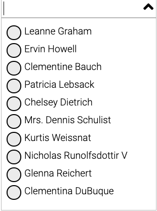

# Angular Typeahead

Angular Typeahead with search functionality


### Installing


```
npm install ja-typeahead
```

### How to use
Install the package
```
npm install ja-typeahead
```
Import the module in app.module.ts
```
import { JaTypeaheadModule } from 'ja-typeahead';
```

Use component in html file
```
<lib-ja-typeahead [data]="parentData" [config]="config" (fetchData)="getRemoteData($event)"
    (onSelectItem)="getSelectedItem($event)"></lib-ja-typeahead>
```
Where
[data] - Input to the typehead (usually JSON form the remote API call)
[config] - various configurations for the customization

Below are the current config parameters (still in work in progress and will be added more params for customization)

```
config = {
    displayLabel: "name", // display name on the typeahead label
    defaultShow: true, // can be shown the result by default or hide. Clicking on input will display the result
    multiSelect: true, // Supports both single select or multi select. single select will display radio buttons whereas multi select will be checkboxes
    limit: 4 // not using it for now
  };
```


### Screen shots




